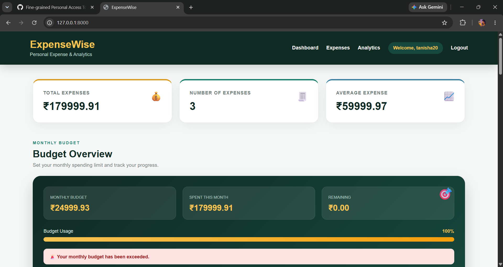
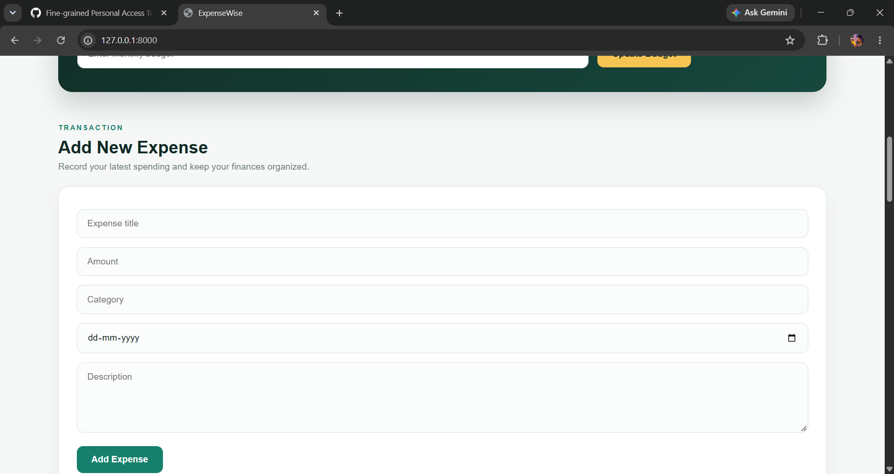
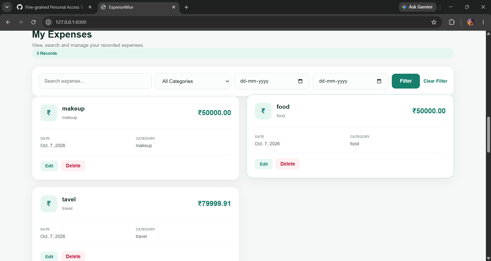
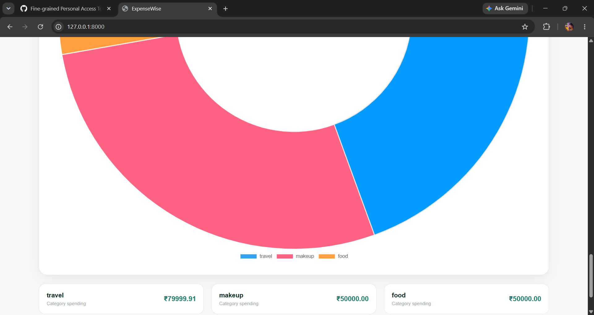
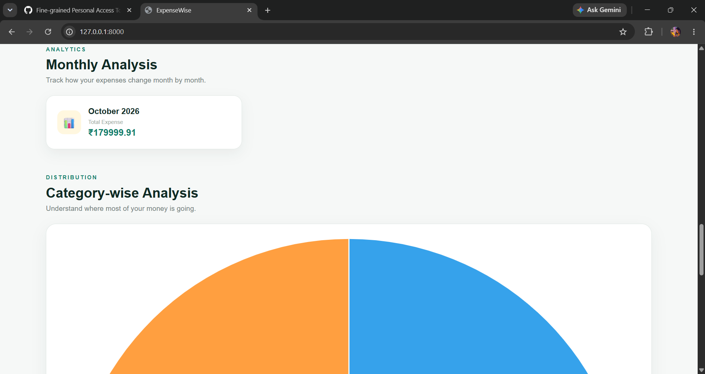

# ExpenseWise – Personal Expense & Analytics System

ExpenseWise is a Django-based personal expense management and analytics web application. It helps users record, manage, search, filter and analyze their daily expenses through a simple and user-friendly dashboard.

## Features

* User Signup and Login
* Secure User Authentication
* Add New Expenses
* Edit Expenses
* Delete Expenses
* Search Expenses
* Category-wise Filtering
* Date-wise Filtering
* Total Expense Calculation
* Average Expense Calculation
* Monthly Expense Analysis
* Category-wise Expense Analysis
* Monthly Budget Management
* Remaining Budget Tracking
* Budget Status Monitoring
* Interactive Expense Analytics
* Responsive User Interface

## Screenshots

### Dashboard



### Add Expense



### Expense List



### Budget



### Analytics



## Technologies Used

* Python
* Django
* SQLite
* HTML
* CSS
* JavaScript
* Chart.js
* Git
* GitHub

## Project Structure

```text
ExpenseWise/
│
├── accounts/
│   ├── migrations/
│   ├── templates/
│   ├── admin.py
│   ├── apps.py
│   ├── models.py
│   ├── urls.py
│   └── views.py
│
├── expenses/
│   ├── migrations/
│   ├── static/
│   ├── templates/
│   ├── admin.py
│   ├── apps.py
│   ├── models.py
│   ├── urls.py
│   └── views.py
│
├── expensewise/
│   ├── settings.py
│   ├── urls.py
│   ├── asgi.py
│   └── wsgi.py
│
├── screenshots/
│   ├── dashboard.png
│   ├── add-expense.png
│   ├── expense-list.png
│   ├── budget.png
│   └── analytics.png
│
├── .gitignore
├── manage.py
├── requirements.txt
└── README.md
```

## How to Run the Project

### 1. Clone the Repository

```text
git clone https://github.com/tanisha822/ExpenseWise.git
```

### 2. Open the Project Folder

```text
cd ExpenseWise
```

### 3. Create Virtual Environment

```text
python -m venv .venv
```

### 4. Activate Virtual Environment

For Windows:

```text
.venv\Scripts\activate
```

### 5. Install Dependencies

```text
pip install -r requirements.txt
```

### 6. Run Database Migrations

```text
python manage.py migrate
```

### 7. Create Superuser

```text
python manage.py createsuperuser
```

### 8. Start Development Server

```text
python manage.py runserver
```

Then open the local development server in your browser.

## Main Modules

### Authentication

Users can create an account, log in and log out securely.

### Expense Management

Users can add, edit and delete their personal expenses.

### Search and Filters

Expenses can be searched by title and filtered using category and date range.

### Budget Management

Users can set a monthly budget and track their spending against the budget.

### Analytics

The dashboard provides total expenses, average expense, monthly analysis and category-wise expense analysis.

### User Data Protection

Each logged-in user can access and manage only their own expenses and budgets.

## Future Improvements

* MySQL database integration
* Expense export to CSV/PDF
* Advanced analytics
* Email notifications
* Deployment
* Mobile-friendly improvements
* Expense reports
* Monthly financial insights

## Author

**Tanisha Barik**

B.Tech – Computer Science & Engineering

Python | Django | SQL | Data Analytics
